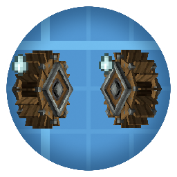

<p align="center"></p>

# Create: Kinetic Interference

*Give your generators some room.*

**English** | [简体中文](README_zh-CN.md)


[CurseForge](https://www.curseforge.com/minecraft/mc-mods/create-kinetic-interference) · [Source](https://github.com/JasdewStarfield/CreateKineticInterference) · [Issues](https://github.com/JasdewStarfield/CreateKineticInterference/issues) · [Changelog](CHANGELOG.md)

**Create: Kinetic Interference (CKI)** is a [Create](https://www.curseforge.com/minecraft/mc-mods/create) addon that reduces the stress capacity of nearby windmills and waterwheels. It encourages spreading out free kinetic power sources instead of stacking them in a small area, with separate settings for windmills and waterwheels.

## Features

- **Interference between nearby generators** — windmills affect other windmills; small and large waterwheels share a separate group. The two groups do not interfere with each other.
- **Engineer's Goggles information** — a running generator affected by interference shows its efficiency and number of interfering sources. Sneaking reveals an additional hint about the radius.
- **Optional source highlights** — enable client highlights, then sneak and right-click a generator while wearing goggles to outline its recorded interfering sources.
- **Configurable balance** — adjust radius, interference factor and distance mode independently for windmills and waterwheels.

## Requirements and installation

This README describes the current source for Minecraft 1.21.1 / NeoForge. Downloaded releases may not include changes listed under **Unreleased** in the [changelog](CHANGELOG.md).

| Item | Requirement |
| --- | --- |
| Minecraft | `1.21.1` |
| Mod loader | NeoForge for Minecraft 1.21.1; current build uses `21.1.218` |
| Java | `21` |
| Install on | Client and server |
| Required mod | Create, with `6.0.9` as the compatibility baseline; current build uses `6.0.9-215`. Newer versions may also work; see the version policy below. |

Install matching NeoForge, Create and CKI versions. Place the mod JARs in the game instance's `mods/` folder; for multiplayer, also install them on the server and follow Create's own dependency requirements. Create Picky Wheels and Flowing Fluids are optional and are not needed to use CKI.

## Quick start

1. Enter a test world with CKI and Create installed. Use the default CKI settings and no optional addons for this first example.
2. Set up two small waterwheels with valid flowing water, less than 32 blocks apart horizontally, with no other waterwheels nearby. Both must generate rotation themselves; they do not need to share a kinetic network.
3. Wear Engineer's Goggles and look at either waterwheel. Allow a few seconds for the periodic interference check.

**Expected result:** each wheel counts one other source and has about **90.9%** efficiency. CKI reduces its stress capacity; it does not directly reduce its rotation speed. Interference tooltip lines appear only while the generator is active and its efficiency is below 100%.

To inspect the sources visually, set `visuals.enableDebugHighlights` to `true` in the client configuration, restart the client, then hold your sneak key (default: `Shift`) and right-click the waterwheel while wearing goggles. Highlights last 3 seconds by default. These interactions do not require operator permissions.

### How interference is calculated

```text
Efficiency = 1 / (1 + Count × Factor)
```

`Count` is the number of other tracked generators in the same group and dimension within the configured radius; the generator itself is excluded. For example, four nearby windmills with a factor of `0.2` give `1 / (1 + 4 × 0.2) ≈ 55.6%` efficiency. One nearby waterwheel with a factor of `0.1` gives `1 / (1 + 1 × 0.1) ≈ 90.9%`.

The default distance mode ignores height, so building generators directly above one another does not avoid interference. Recorded sources in unloaded chunks are retained; see [compatibility and limitations](#compatibility-and-limitations).

## Configuration

Start the game and enter a world once to generate the configuration files. The paths below are relative to the game instance directory for singleplayer, or the server directory for a dedicated server.

| Location | Scope | Editing guidance |
| --- | --- | --- |
| `config/createkineticinterference-server.toml` | Gameplay rules, controlled by the server | Stop the world/server before editing, then reopen it |
| `config/createkineticinterference-client.toml` | Highlights on that client only | Close the client before editing, then restart it |

On the current NeoForge build, an existing `serverconfig/createkineticinterference-server.toml` inside the world directory overrides the server file in `config/`. In singleplayer, the world directory is normally `saves/<world>/`; on a dedicated server, use the directory selected by `level-name`. Edit the active override if one exists. Changing your local server config does not override a multiplayer server's rules.

The restart workflow above avoids ambiguity about active files and recalculation; it is not a claim that every setting requires a restart. CKI has no dedicated configuration reload command.

### Server settings

The section names below are the TOML sections containing each key.

| Section | Setting | Default | Effect |
| --- | --- | --- | --- |
| `general.windmill` | `interferenceRadius` | `32.0` | Windmill detection radius in blocks |
| `general.windmill` | `interferenceFactor` | `0.2` | Penalty per nearby windmill; `0` disables the penalty |
| `general.windmill` | `distanceCalculationMode` | `EUCLIDEAN_2D` | Windmill distance mode |
| `general.windmill` | `checkInterval` | `40` | Periodic windmill check interval in ticks; about 2 seconds at 20 TPS |
| `general.waterwheel` | `interferenceRadius` | `32.0` | Shared detection radius for small and large waterwheels |
| `general.waterwheel` | `interferenceFactor` | `0.1` | Penalty per nearby waterwheel; `0` disables the penalty |
| `general.waterwheel` | `distanceCalculationMode` | `EUCLIDEAN_2D` | Waterwheel distance mode |

Waterwheels use Create's periodic update cycle and do not have a separate CKI `checkInterval` setting.

| Distance mode | Rule |
| --- | --- |
| `EUCLIDEAN_2D` | Horizontal straight-line distance; ignores height. **Default for both groups.** |
| `EUCLIDEAN_3D` | Straight-line distance in 3D; spherical detection area |
| `MANHATTAN_2D` | Sum of absolute X and Z differences |
| `MANHATTAN_3D` | Sum of absolute X, Y and Z differences |

### Client settings

| Section | Setting | Default | Effect |
| --- | --- | --- | --- |
| `visuals` | `enableDebugHighlights` | `false` | Enable source outlines when sneaking and right-clicking with goggles |
| `visuals` | `debugHighlightsDuration` | `3000` | Highlight duration in milliseconds |

## Compatibility and limitations

- **Create versions:** CKI targets Create `6.0.9` and later. Newer versions may be compatible, but compatibility is not guaranteed; major version upgrades are likely to need additional compatibility patches. The current dependency declaration, `[6.0.9,6.1.0)`, uses a conservative upper bound, not a confirmed incompatibility boundary. The loader currently rejects versions outside that declared range, so extending it requires an updated dependency declaration as well as any necessary compatibility fixes.
- **Create Picky Wheels and Flowing Fluids:** the current source includes adjustments intended to let CKI's capacity, tooltip and removal behavior coexist with these addons. This does not establish compatibility with every version or configuration; tooltip presentation and natural fluid/biome interactions should be checked in your modpack. When using both addons, also follow Create Picky Wheels' own Flowing Fluids configuration guidance for water-source requirements.
- **Loaded and unloaded sources:** unloading a chunk retains its recorded sources and can therefore retain their interference. Missing or replaced generators are removed from the records when queried in loaded chunks. CKI does not force-load chunks to perform this repair.
- **Supported generators:** windmills, small waterwheels and large waterwheels. Other generators do not automatically participate. Addons that replace Create's capacity or lifecycle behavior may need separate compatibility work.

## Building from source

Use Java 21 and run the following from this version repository's root:

```powershell
.\gradlew.bat build --no-configuration-cache --no-daemon --console=plain
```

On Linux or macOS, use `bash ./gradlew` with the same arguments. The mod JAR is generated in `build/libs/`.

## Feedback

Report bugs and suggestions on [Issues](https://github.com/JasdewStarfield/CreateKineticInterference/issues). Include:

- Minecraft, NeoForge, Create, CKI and relevant addon versions.
- Whether the issue occurs in singleplayer or on a dedicated server.
- Reproduction steps, relevant configuration, expected behavior and actual behavior.
- Logs or a crash report, plus a screenshot for tooltip/highlight issues.

## License and credits

Code is licensed under the **MIT License**. See [LICENSE](LICENSE).

- Author: Jasdew Starfield.
- Built on [Create](https://www.curseforge.com/minecraft/mc-mods/create) and [NeoForge](https://neoforged.net/).
