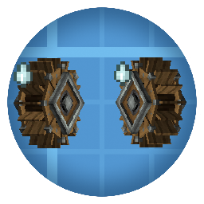

<p align="center"></p>

# Create: Kinetic Interference

*给动力源留一点空间。*

[English](README.md) | **简体中文**


[CurseForge](https://www.curseforge.com/minecraft/mc-mods/create-kinetic-interference) · [源码](https://github.com/JasdewStarfield/CreateKineticInterference) · [问题反馈](https://github.com/JasdewStarfield/CreateKineticInterference/issues) · [更新日志](CHANGELOG_zh-CN.md)

**Create: Kinetic Interference（CKI，机械动力：动力干扰）** 为 Create 风车与水车提供共享的当地应力供给。低需求设备保持满效，密集阵列的总容量逐渐饱和；扩大建设范围可以获得更多动力。

## 功能

- 风车竞争风力供给，小水车与大水车按各自原始产出分享水力供给，两种资源独立计算。
- 同一水平位置的上下堆叠共用供给，跨动力网络也会竞争；移动设备时，供给随位置平滑变化。
- 河流更适合集中建设水车，山地和海洋更适合集中建设风车。群系在固定高度采样，默认 Y=64。
- 工程师护目镜在应力产出后以灰色括号显示原始 SU，并显示供给利用效率和待更新状态；潜行时增加资源条件、竞争源数量和卸载估计源信息。
- 可选高亮最多展示 64 个附近竞争源，服务端计算包含全部竞争源。
- 旧世界保持原有计数模型，管理员可修改服务端配置并重启，切换到密度模型。

工作中的动力源还显示“当地动力条件：基础的 1.5 倍”这样的对比；数值越高，当地能共享的动力越多。停转时隐藏这项对比和供给利用效率。

## 环境与安装

本 README 描述当前 2.0 源码。公开下载可能仍为较早版本，详见[更新日志](CHANGELOG_zh-CN.md)。

| 项目 | 要求 |
| --- | --- |
| Minecraft | `1.21.1` |
| 加载器 | Minecraft 1.21.1 的 NeoForge `21.1.219` 或以上 |
| Java | `21` |
| 安装端 | 客户端与服务端 |
| Create | 当前构建使用 `6.0.10`，声明范围为 `[6.0.10,6.1.0)` |

客户端与服务端安装一致的 CKI，并安装 Create 及其依赖。将 JAR 放入各实例的 `mods/` 目录。Create Picky Wheels 与 Flowing Fluids 为可选附属。

## 快速开始

1. 使用 CKI、Create 和默认配置创建测试世界。
2. 建造两台水平距离小于 32 格、能够正常运行的小水车。每台水车应能自行产生转速，可以接入不同动力网络。
3. 佩戴工程师护目镜查看水车，等待供给分配完成。继续在同一区域增加水车，比较总 SU。

低需求设备保持原始容量，集中建设并逼近当地容量时效率快速下降。增加设备间距或向新的区域扩建，可以使用更多供给。CKI 调整应力容量，转速由 Create 管理。

需要查看竞争源时，在客户端配置中启用 `visuals.enableDebugHighlights`，重启客户端，然后佩戴护目镜并潜行（默认 `Shift`）右键动力源。高亮默认持续 3 秒。

### 供给与卸载记录

密度模型为每台设备定义一个水平采集圆。圆形覆盖重叠时竞争同一份可持续供给；默认采集半径 16 格，两个源中心最多相距 32 格时仍可能竞争。设备自身的原始 SU 也计入需求，因此超大型单机同样可能达到当地容量上限。群系供给不会让设备超过自己的原始产出。

卸载设备保留最后已知需求。旧版只有坐标的记录在迁移时使用配置中的估计值，设备加载后替换为真实值。区块已加载且原位置的设备被拆除或替换时，清理对应记录；这些查询不会加载或生成区块。

## 配置

进入世界一次后生成配置。以下路径相对于游戏实例或专用服务端目录。

| 文件 | 用途 |
| --- | --- |
| `config/createkineticinterference-server.toml` | 服务端控制的玩法规则 |
| `config/createkineticinterference-client.toml` | 本客户端的高亮设置 |

世界目录内已有的 `serverconfig/createkineticinterference-server.toml` 优先于实例配置。单人世界通常位于 `saves/<world>/`；专用服务端使用 `level-name` 指定的目录。修改玩法设置前停止世界或服务端，编辑实际生效的文件后重启。多人客户端使用服务器规则。

### 密度配置

下表的路径由 TOML 节名与配置键组成。密度模型固定使用 XZ 平面的欧氏距离。

| 路径 | 默认值 | 作用 |
| --- | --- | --- |
| `calculationModel` | `AUTO` | 使用世界保存的选择；新世界选择 DENSITY，检测到旧世界或旧配置时选择 LEGACY |
| `density.water.collectionRadius` | `16` | 水力采集半径，单位格 |
| `density.wind.collectionRadius` | `16` | 风力采集半径，单位格 |
| `density.water.referenceCapacitySU` | `4096` | 普通群系单个采集圆的水力参考供给 |
| `density.wind.referenceCapacitySU` | `6144` | 普通群系单个采集圆的风力参考供给 |
| `density.water.profile` | `createkineticinterference:water` | 水力群系规则 |
| `density.wind.profile` | `createkineticinterference:wind` | 风力群系规则 |
| `density.softCapPower` | `8` | 饱和拐点锐度，越大越接近容量上限才开始降效；范围 2～8 |
| `density.integrationStep` | `2` | 积分间距，最多为各类型采集半径的四分之一 |
| `density.environmentGridStep` | `4` | 环境采样间距 |
| `density.biomeBlendRadius` | `8` | 群系平滑半径 |
| `density.biomeSampleY` | `64` | 固定采样高度，夹到维度合法建造高度内 |
| `density.recheckInterval` | `40` | 原始能力补查周期，单位 tick |
| `density.workBudgetMs` | `1.25` | 每 tick 的目标计算预算，大规模重建会显示待更新状态 |
| `density.water.legacyUnloadedPotentialSU` | `256` | 旧版未加载水车坐标的需求估计值 |
| `density.wind.legacyUnloadedPotentialSU` | `4096` | 旧版未加载风车坐标的需求估计值 |

内置丰富群系将供给乘以 2。水力引用通用河流群系标签；风力引用通用海洋、山地与丘陵标签，加入这些标签的模组群系也获得加成。同一 XZ 列的设备采用相同采样高度。

### 旧世界与模型切换

已有密度配置会保留原数值。采用新版平衡时，停止世界后将 `density.softCapPower` 改为 `8`、水力 `referenceCapacitySU` 改为 `4096`、风力改为 `6144`，然后重启。内置优选群系供给提高到两倍；自定义数据包继续使用自己的规则。

在均匀普通群系、同一 XZ 的参考布局中，需求低于约 75% 圆容量时保持满效，接近容量后快速削减。单台 4096 SU 风车可满效，两台约 69%；均匀优选群系的两台可满效。实际布局、群系边界和采集范围会改变结果。

1. 备份世界及其实际生效的 CKI 服务端配置。
2. 尽量加载现有生产区域，核实设备并替换旧坐标的估计需求。
3. 停止世界或服务端，将生效配置设为 `calculationModel = "DENSITY"`，然后重启。
4. 核对设备 SU，并按需要调整过载网络。密度模型可能改变旧工厂的容量。

同版本中设为 `calculationModel = "LEGACY"` 并重启，可切回计数模式。`AUTO` 保持世界保存的选择。回退旧版 JAR 时，恢复与其匹配的世界及配置备份。

LEGACY 使用原有的 `general.windmill`、`general.waterwheel` 半径、系数和距离设置。默认半径 32，风车系数 0.2，水车系数 0.1：

```text
效率 = 1 / (1 + 附近同类设备数 × 系数)
```

一台邻近水车对应约 90.9% 效率。距离模式包括 `EUCLIDEAN_2D`、`EUCLIDEAN_3D`、`MANHATTAN_2D`、`MANHATTAN_3D`，两组默认均为 `EUCLIDEAN_2D`。风车使用 `general.windmill.checkInterval`，默认 40 tick。

### 数据包规则

在已有的 Minecraft 1.21.1 数据包中增加 JSON 资源，例如 `data/your_pack/cki_density_profiles/water.json`：

```json
{
  "schema_version": 1,
  "resource_type": "water",
  "default_multiplier": 1.0,
  "rules": [
    { "biome_tag": "createkineticinterference:water_abundant", "priority": 100, "multiplier": 2.0 }
  ],
  "dimension_multipliers": { "minecraft:the_nether": 0.5 }
}
```

将 `density.water.profile` 设为 `your_pack:water` 后重启。以后修改该规则及其群系标签，可以用 `/reload` 加载。命中的最高优先级规则应用一次；同优先级规则重叠、必需标签缺失、非法数值或所选 profile 缺失时，拒绝新规则集并保留上一套完整规则。首次启动失败时使用内置规则，并在日志中记录问题。

可在数据包中扩展 `data/createkineticinterference/tags/worldgen/biome/water_abundant.json` 或 `wind_abundant.json`，加入模组群系。可选群系成员可写为 `{"id":"your_mod:biome","required":false}`。

### 诊断命令与客户端设置

以下命令需要管理员权限等级 2，只读取数据：

```text
/cki density inspect <pos>
/cki density sample <water|wind> <center> <radius> <step>
/cki density stats
```

`inspect` 显示原始及分配 SU、当地供给，以及已加载、快照和估计竞争源数量；`stats` 显示待更新时长、队列延迟和计算工作量；`sample` 将供给、需求和兑现比例导出为服务端 `cki-diagnostics/` 目录下的 CSV，并限制查询范围与工作量。

| 客户端设置 | 默认值 |
| --- | --- |
| `visuals.enableDebugHighlights` | `false` |
| `visuals.debugHighlightsDuration` | `3000` 毫秒 |

## 兼容性

支持 Create 风车、小水车和大水车。已支持的 Picky Wheels 容量倍率计入原始需求，它的护目镜追加文本与 Flowing Fluids 的移除逻辑继续通过各自挂钩运行。组合使用时，请按 Picky Wheels 的 Flowing Fluids 设置配置水源要求。替换 Create 共用容量或生命周期路径的附属可能需要专门适配。

## 从源码构建

使用 Java 21，在本版本仓库执行：

```powershell
.\gradlew.bat build --no-configuration-cache --no-daemon --console=plain
```

Linux / macOS 使用 `bash ./gradlew` 和相同参数。JAR 生成于 `build/libs/`。

## 问题反馈

通过 [Issues](https://github.com/JasdewStarfield/CreateKineticInterference/issues) 提交问题，包含 Minecraft、NeoForge、Create、CKI 和相关附属版本、单人或服务端环境、复现步骤、生效配置及日志。护目镜或高亮问题请附截图。

## 许可证与致谢

代码采用 **MIT** 许可证，见 [LICENSE](LICENSE)。作者：Jasdew Starfield。基于 [Create](https://www.curseforge.com/minecraft/mc-mods/create) 与 [NeoForge](https://neoforged.net/) 开发。
